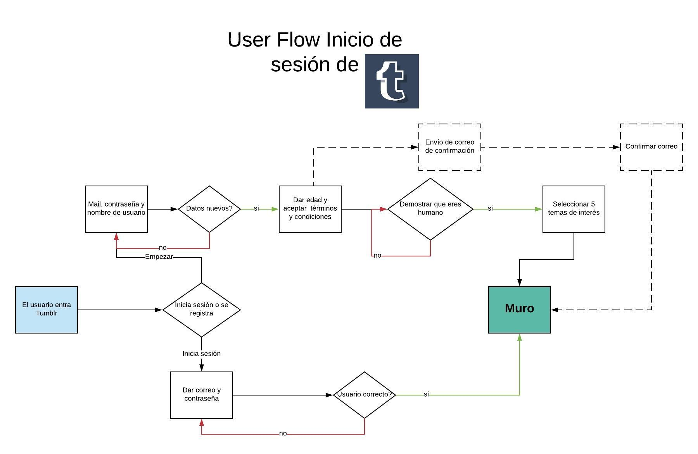
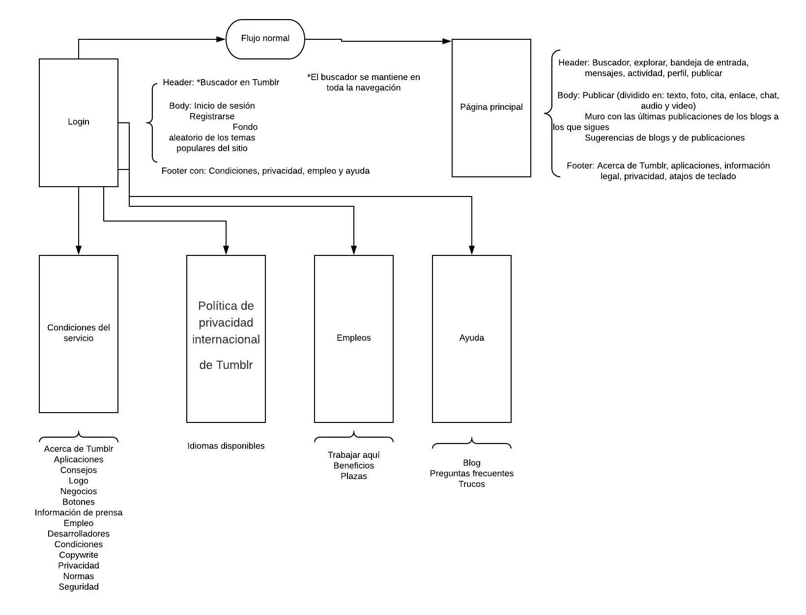

# Ejercicios de User Flow y Flow Chart

Para este ejercicio decidí mapear el flow de mi red favorita del mundo: Tumblr.
Este ejercicio fue interesante pues el analizar paso por paso en algo a lo que en el pasado nunca le había prestado atención fue bastante iluminador con respecto a las decisiones que nosotras como futuras Ux tendremos que realizar para que los futuros usuarios hagan sus interacciones de una manera fácil y sin tener que pensarlas demasiado.

## User Flow
Por cuestión de tiempo solo hice el user flow del registro e inicio de sesión de esta red social.

## Flow Chart
Por cuestión de tiempo hice el flow chart muy general.

## Leyes de Nielsen en Tumblr

1. **Visibilidad del estado del sistema**. Este primer punto lo dejaría a la mitad. Pues aunque si hae un hover sobre los íconos que representan cada parte del menú (explorar,mensajes, etc.) No es tan evidente, pues son muy chicos.

 

2. **Adecuación entre el sistema y el mundo real**. Los iconos que usa son bastante descriptivos. Ejemplo: para postear un video tiene un logo de una cámara de video.

 

3. **Libertad y control por el usuario.** Al rebloguear y publicar tienes la opción de cerrar la publicación, publicar ahora, agendarla,añadir a la cola, guardar como borrador y hacerlo privado. Posteriormente puedes borrar y editar el post.

 

4. **Consistencia y estándares.** Mantiene los estándares de que lo primero que ve el usuario en su muro es lo de publicar algo, pero divide en primera instancia qué es lo que el usuario va a publicar (texto, video, música, etc.)

 

5. **Prevención de errores.** Cuando te registras te avisa si el correo que quieres dar de alta ya está en uso, igual que el nombre de usuario que eliges.

 

6. **Reconocer mejor que recordar.** Tumblr muestra 2 tipos de historiales: el de los reblogueos y posts propios y el de los likes que has dado, pero no puedes filtarlos.

 

7. **Flexibilidad y eficiencia de uso.** Tumblr tiene una guía de atajos con el teclado y te da recomendaciones de post que podrían gustarte, así como de blogs según tus gustos.

 

8. **Estética y diseño minimalista.** Tumblr es minimalista al mostrarte en tu muro una publicación a la vez, dándole así la importancia debida a cada post (lo cual está padre porque algunos son muy largos o con muchas imágenes), pero al meterse uno a "explorar" o "buscar" se muestran varias miniaturas relacionadas con la búsqueda.

 

9. **Ayudar a los usuarios a reconocer, diagnosticar y solucionar los errores.** Cuando hay un error la plataforma es bastante clara y te manda a su sitio de "ayuda".
